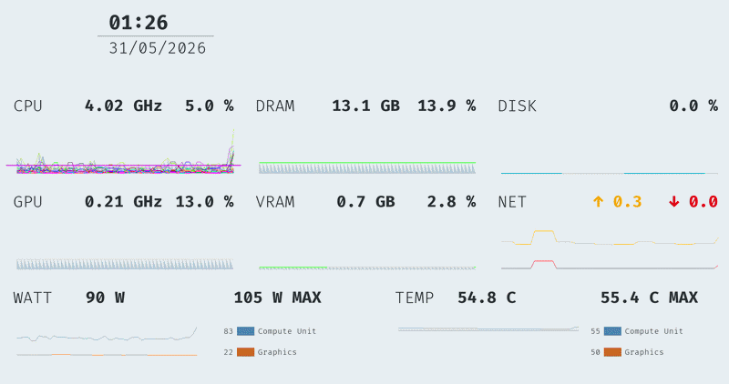
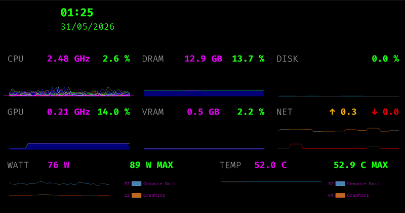

# Monitory

*_Monitory is a Cross-Platform Monitoring App which allows to Monitor a Linux or Windows Device over the network with a nice gui on the client device*

## Server:
*_Monitory Server Apps are available for Windows and Linux, this apps reading the hardware and sending it via TCP to the Clients_*
#### Windows:
 - Navigate to the Releases and download a Windows Server version
 - It's good practice to Run the App as Admin
 - When you like the app and want keep it running every Windows Start, create an automated Task <https://www.windowscentral.com/how-create-automated-tasks-windows-11>

#### Linux:
 - Navigate to the Releases and download a Linux Server version
 - Make sure you have `mpstat` `iostat` `ifstat` `cat` `nvidia-smi` installed
 - Only NVIDIA GPUs are supported for Linux
 - Run it and when you like it add it as start up application

## Client:
*_Monitory Client Apps are available for all devices which can run Python 3.11, this apps reading the TCP Data sended from the Monitory Server App to display the Hardware Infos on this Client Device_*
 

#### Client Install:
- Navigate to the Releases and download the project source
- `cd "./Monitory/Monitory_Client_Source/monitory_client_pygame/"`
- `python3 -m venv .venv`
- Activate the env, on linux `source .venv/bin/activate` , on windows `.venv/bin/activate`
- Add the requirements `pip install -r requirements.txt`
- Run it `python3 main.py`

#### 2nd Run:
- Activate the env
- `python3 main.py`

## Development:
 - Server Applications are written in c# .NET (for the Windows server), and with python on the linux server
 - Client Application is written in python 3.11
